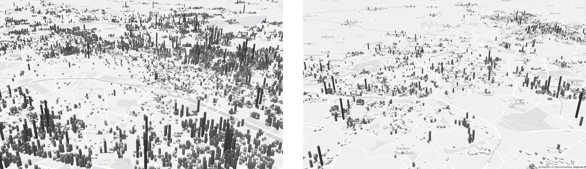
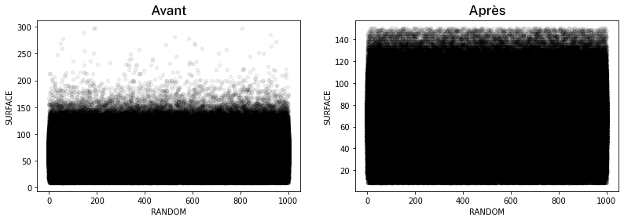
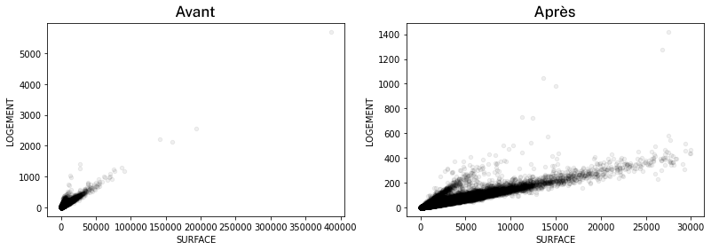

# La France des logements sociaux (3D)

➤ [Visualiser la carte](https://beckrel.github.io/rpls-3d/) · La hauteur des hexagones (`hexbin`) matérialise la surface habitable cumulée.

## Données d'entrée & Stack technique

- Données d'entrée : [RPLS géolocalisé 2019](https://www.data.gouv.fr/fr/datasets/repertoire-des-logements-locatifs-des-bailleurs-sociaux/)
- Environnement : cahier `Jupyter` via `Google Colab` (`Python`)
- Principales bibliothèques :
  - `Pandas`/`GeoPandas` pour la manipulation de données
  - `H3` pour l'indexation spatiale
- Couche cartographique : `Mapbox`

## Code-source & Données de sortie

#### Contenu principal du répertoire

- `resources/notebook.ipynb` : le cahier `Jupyter` utilisé pour manipuler les données
- `resources/data.geojson.zip` : les données de sortie au format `geojson` (35 mo)

#### Format de `data.geojson`

Chaque `feature` représente un `hexbin` (polygone) avec 2 propriétés :

- `count` : le nombre de logements sociaux
- `surface` : la surface habitable cumulée en m²

## Traitement des données

1. Les données du RPLS, notamment les coordonnées géographiques, sont considérées `as-is`
2. Nombre initial de logements locatifs sociaux (LLS) dans le RPLS : 5 088 749
3. Nombre de LLS après retraitement des `NaN`/`NaT` : 5 076 090
4. Modification des surfaces anormales (?) en leur réaffectant une valeur médiane

5. Recherche et affectation d'un identifiant `Hexbin` `H3` à chaque logement
6. Calcul du nombre de logements et de la surface cumulée (en m²) par `Hexbin` `H3`
7. Suppression des `Hexbin` `H3` dont les valeurs paraissent anormales (?)
8. Nombre de LLS après retraitement : 5 007 741

## Licence

Le code-source est sous licence `MIT`, le contenu et les illustrations sous licence `CC BY SA 4.0`.  
Copyright © 2022 [BECKREL](https://www.linkedin.com/company/beckrel), [Charles-Henri ARNOULD](https://www.linkedin.com/in/charnould/) — contact@beckrel.com
